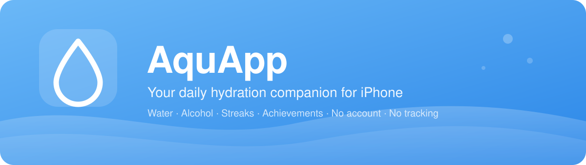
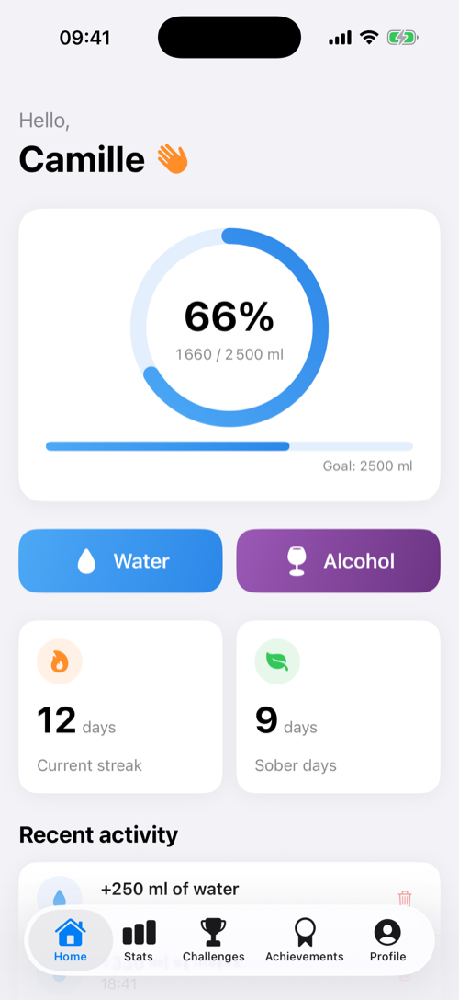
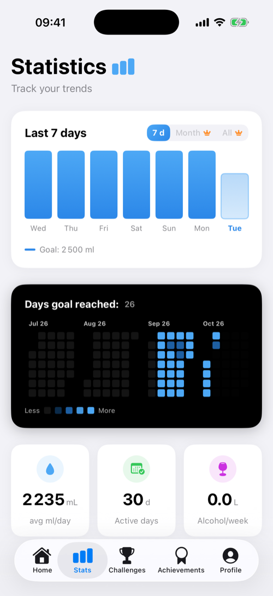
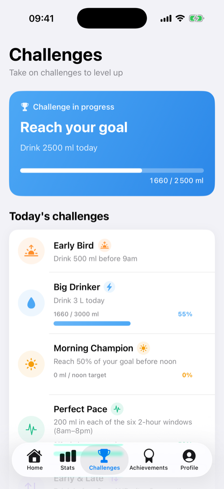
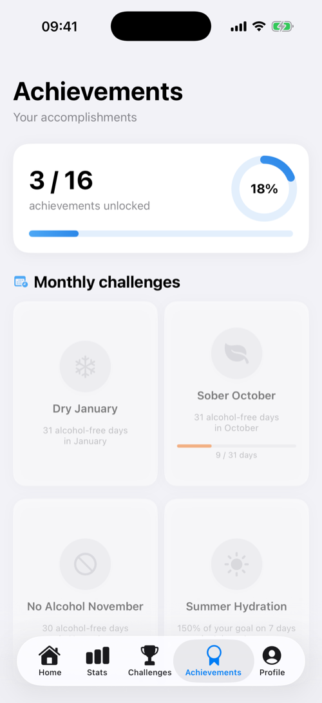
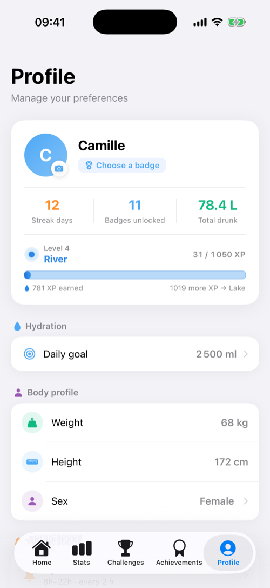
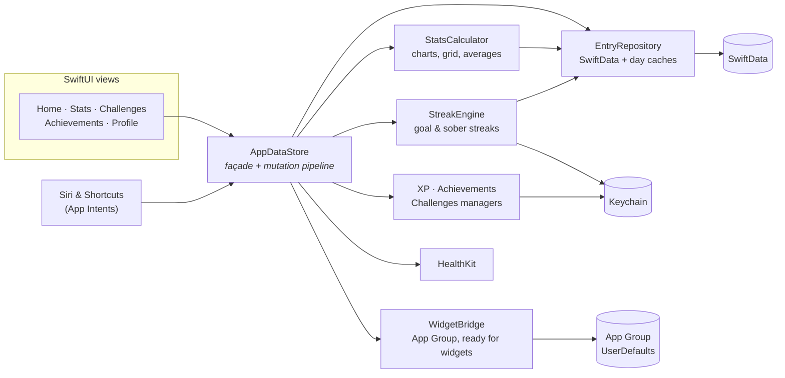
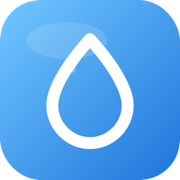

<p align="center">
  
</p>

<p align="center">
  <a href="https://github.com/HarpeLm/AquApp/actions/workflows/ci.yml"></a>
  
  
  
  
  
  
</p>

<p align="center">
  <b>Track your water and alcohol, hit your daily goal, build streaks and unlock achievements —<br>
  with no account, no server of our own and no tracking.</b>
</p>

> [!NOTE]
> **🇫🇷 A French-speaking project.** AquApp is designed and built in French first: the app ships in **French and English**, while commit messages, code comments and the privacy policy are written in French. Issues and pull requests are welcome in either language.

---

## 📱 Screenshots

The gallery follows your GitHub theme: switch to dark mode to see the dark screens.

<table>
  <tr>
    <td align="center"><b>Home</b></td>
    <td align="center"><b>Statistics</b></td>
    <td align="center"><b>Challenges</b></td>
    <td align="center"><b>Achievements</b></td>
    <td align="center"><b>Profile</b></td>
  </tr>
  <tr>
    <td><picture><source media="(prefers-color-scheme: dark)" srcset="docs/assets/screenshots/home-dark.png"></picture></td>
    <td><picture><source media="(prefers-color-scheme: dark)" srcset="docs/assets/screenshots/stats-dark.png"></picture></td>
    <td><picture><source media="(prefers-color-scheme: dark)" srcset="docs/assets/screenshots/challenges-dark.png"></picture></td>
    <td><picture><source media="(prefers-color-scheme: dark)" srcset="docs/assets/screenshots/achievements-dark.png"></picture></td>
    <td><picture><source media="(prefers-color-scheme: dark)" srcset="docs/assets/screenshots/profile-dark.png"></picture></td>
  </tr>
</table>

<sub>Captured on an iPhone 17 Pro simulator with demo data (see <a href="#demo-data-for-screenshots">Demo data</a>).</sub>

---

## ✨ Features

<table>
  <tr>
    <td width="50%" valign="top">

### 💧 Hydration
- One-tap presets and custom amounts
- Personal daily goal computed from your body profile
- Goal raised automatically during heatwaves
- Configurable reminders (never at night)
- Today, 7-day and full history

</td>
    <td width="50%" valign="top">

### 🍷 Alcohol
- Log drinks, including your own custom drinks
- Water to drink to make up for each drink
- Weekly and monthly consumption trends
- Alcohol-free day streak, recomputed from your data

</td>
  </tr>
  <tr>
    <td valign="top">

### 🎮 Motivation
- XP with **8 levels**, from *Drop* to *Aqua Legend*
- **16 achievements**, standard and monthly
- **10 daily challenges**
- Goal and sober streaks, equippable badges

</td>
    <td valign="top">

### 📊 Statistics
- 7-day chart, month and all-time views (Premium)
- GitHub-style yearly goal grid
- Alcohol analysis (Premium) and water to make up

</td>
  </tr>
  <tr>
    <td valign="top">

### 🔌 iOS integration
- **Apple Health**: writes water; reads steps, workouts and sleep for some challenges (asked during onboarding, with an explanation)
- **Siri & Shortcuts** via App Intents
- Local notifications
- French and English, with proper plurals

</td>
    <td valign="top">

### ♿ Accessibility & design
- Follows the system **text size** (Dynamic Type)
- VoiceOver labels on key screens
- Light, dark or system theme
- 8 alternate app icons

</td>
  </tr>
</table>

### 🗣️ Siri phrases

Available as soon as the app is installed — no setup needed.

| Say | What happens |
|---|---|
| “Add water in AquApp” | Logs 250 ml (or the amount you choose) and tells you where you stand |
| “Log Beer in AquApp” (or Wine, Cider…) | Logs a standard serving and tells you how much water to drink to make up for it |
| “My progress in AquApp” | Reads out today's intake against your goal |

French phrases work too: *« Ajoute de l'eau dans AquApp »*, *« Où j'en suis dans AquApp »*.

---

## 🔒 Privacy first

| | |
|---|---|
| ❌ | No account, no email |
| ❌ | No server of our own, no analytics, no ads, no tracking |
| ✅ | Your data stays on your iPhone (SwiftData, Keychain) |
| ✅ | Apple Health data is read and used **on device only** |
| ℹ️ | One exception, optional: an **approximate location (~1 km)** is sent to the Open-Meteo weather service to detect heatwaves |

Full details in the [privacy policy](docs/PRIVACY.md) (French).

---

## 🏗️ Architecture

Views talk to a single façade, `AppDataStore`. It runs every change (add, delete, goal change) through one pipeline and delegates the actual work to small, testable types. Siri intents go through the same façade, so a drink logged by voice updates streaks, XP and achievements exactly like one logged in the app.



| Folder | Contents |
|---|---|
| `AquApp/Data` | `AppDataStore`, `EntryRepository`, `StatsCalculator`, `StreakEngine`, `WidgetBridge`, XP, StoreKit, weather, daily reset |
| `AquApp/Utils` | Health authorization, Keychain, reminders, `scaledFont`, demo data |
| `AquApp/Intents` | Siri intents and App Shortcuts |
| `AquApp/Views` | Home, Stats, Challenges, Achievements, Profile, Onboarding, Wrapped (not enabled yet) |
| `AquApp/AppColor.swift` | `Color.app` palette, the single source of truth for colors |
| `AquAppTests` | Unit tests |

---

## 🛠️ Tech stack

Swift · SwiftUI · SwiftData · HealthKit · App Intents · StoreKit 2 · UserNotifications · Keychain Services · String Catalogs · GitHub Actions

---

## 🚀 Getting started

**Requirements:** a Mac with **Xcode 26** or later, an **iOS 17+** device or simulator, and an Apple Developer account to use HealthKit and App Groups on a real device.

```bash
git clone https://github.com/HarpeLm/AquApp.git
cd AquApp
open AquApp.xcodeproj
```

Then select the **AquApp** target, set your Team in *Signing & Capabilities*, pick a simulator and press **⌘R**.

Capabilities used: HealthKit, App Groups, In-App Purchase.

---

## 🧪 Tests

The suite covers the hydration and alcohol formulas, streaks, statistics, SwiftData integrity, XP and achievements, Siri intents, plurals, StoreKit entitlements and performance on a year of data. Tests run on every push with GitHub Actions.

```bash
xcodebuild test \
  -scheme AquApp \
  -project AquApp.xcodeproj \
  -destination 'platform=iOS Simulator,name=iPhone 17 Pro' \
  -only-testing:AquAppTests
```

Unit tests run inside the app on the simulator; the app's own settings and Keychain are saved before the suite and restored after it.

### Demo data for screenshots

Debug builds accept a `-demoData` launch argument that fills an in-memory store with 40 days of realistic data. It changes the simulator's Keychain and settings, so use a dedicated simulator:

```bash
xcrun simctl launch <simulator-id> com.fabian.dargaud.AquApp -demoData -AppleLanguages "(en)" -AppleLocale en_FR
```

---

## 🗺️ Roadmap

| ✅ Available | 🚧 In progress | 🔮 Coming |
|---|---|---|
| Water and alcohol tracking | v1.0 App Store release | Home Screen widgets |
| Personal goal and heatwave adjustment | Premium subscriptions | Live Activities and Dynamic Island |
| Streaks, XP, achievements, challenges | Final App Store polish | AquApp Wrapped (yearly recap) |
| Statistics and yearly grid | | iCloud sync |
| Apple Health, Siri & Shortcuts | | Apple Watch app |
| French and English, Dynamic Type | | |

**Status:** pre-release. The app is free during launch; Premium features will be enabled after v1.0.

---

## 🤝 Contributing

Contributions are welcome, in French or English.

1. Fork the project and create a branch: `git checkout -b feature/my-feature`
2. Make your change and add or update tests
3. Check that the tests pass
4. Open a pull request

---

## 👤 Author

**Fabian Dargaud** — [@HarpeLm](https://github.com/HarpeLm)

## 📄 License

AquApp is released under the [MIT license](LICENSE).

<p align="center">
  <br>
  <sub>Made with Swift, SwiftUI and plenty of water 💧</sub>
</p>
